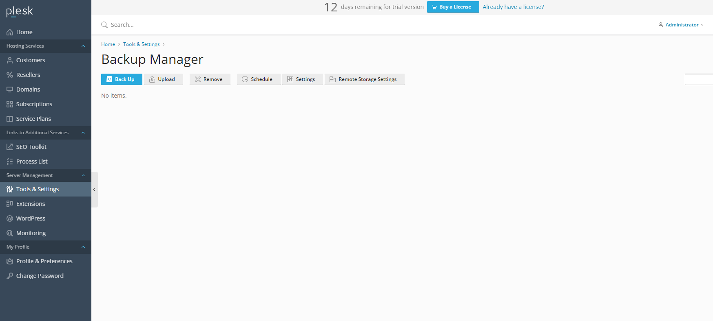
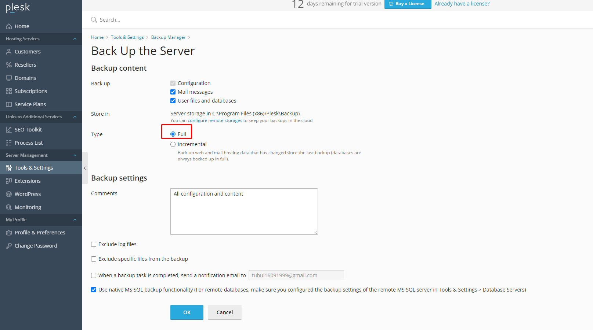
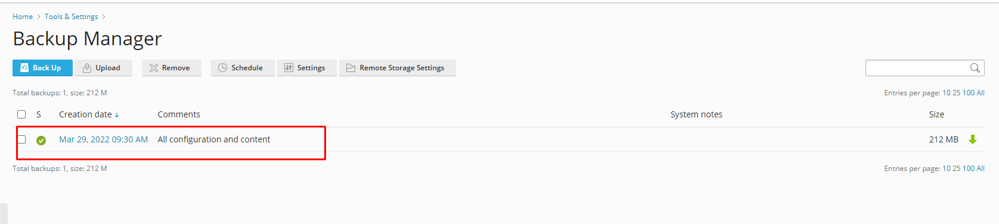
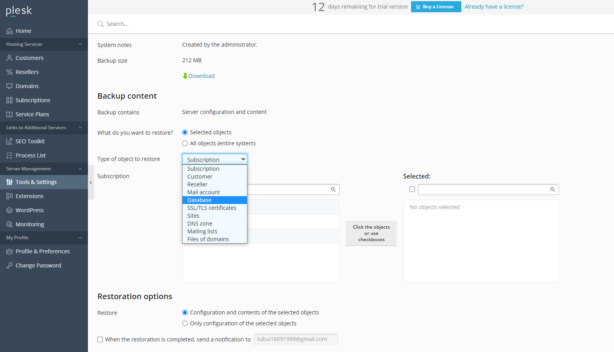

# Backup

- Ta chọn option `Full` để backup toàn bộ dữ liệu

- Bản sao lưu sẽ hiển thị đầy đủ thời điểm sao lưu 

# Restore
- Chọn bản sao lưu cần restore 

- Để khôi phục tất cả các đối tượng:
	+ Chọn option `All Objects`

- Để khôi phục các đối tượng cụ thể của một loại cụ thể, chẳng hạn như hộp thư hoặc vùng DNS của miền
	+ Chọn đối `Selected Objects`
	+ Chọn loại đối tượng để khôi phục. Ví dụ `Databases`

	
	
- Ta có thể khôi phục các loại đối tượng sau từ bản sao lưu 
	+ Reseller
	+ Customer
	+ Subcription
	+ Site 
	+ DNS zone
	+ Database
	+ SSL/TLS certificate
	+ Mailing list
	+ Mail Account
	+ Files and directories

- Tích vào `Restoration options` để sau quá trình khôi phục hoàn tất, sẽ có thông báo gửi đến email

