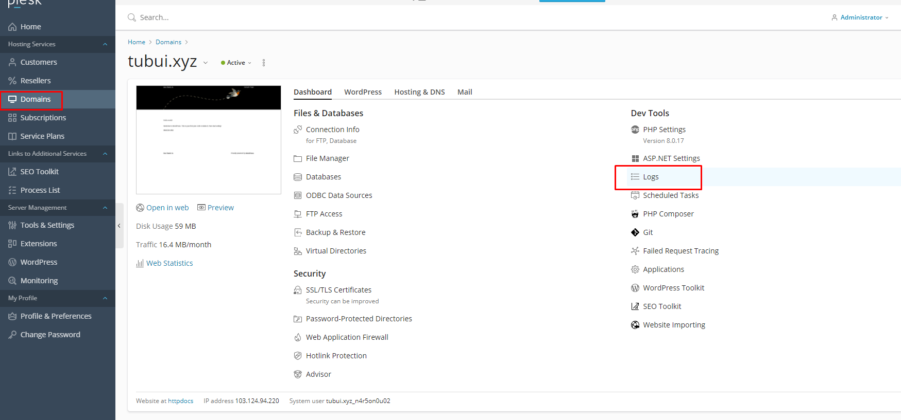
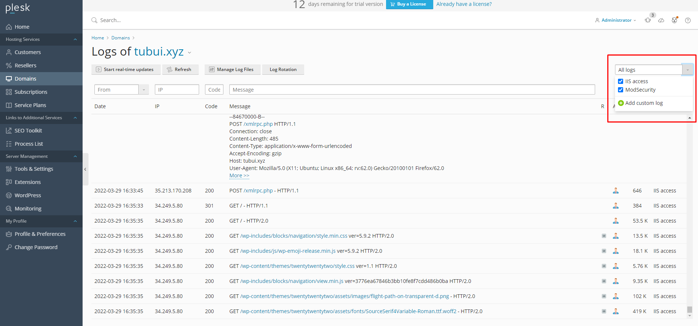

# Log File
Tất cả các kết nối đến máy chủ Web và yêu cầu 
## Plesk Management Service
- Logs:
	+ Access Log: `%plesk_dir%admin\logs\W3SVC<IIS site ID>\ex<date>.log`
	+ PHP errors `(panel log): %plesk_dir%admin\logs\php_error.log`
	+ Debug logs: `%plesk_dir%admin\logs\plesklog_debugXXXXXXXX.log (create DWORD value Debug=1 in HKLM\SOFTWARE\Wow6432Node\PLESK\PSA Config\Config)`

## Plesk SQL Server (MySQL)
- Logs:
	+ `%plesk_dir%MySQL\Data\*.err`

## Plesk Installer
- Logs:
	+ `C:\ParallelsInstaller\autoinstaller3.log`
	+ `C:\ProgramData\Plesk\Installer\autoinstaller3.log`

## phpMyAdmin
- Logs:
	+ `%plesk_dir%admin\logs\W3SVC<IIS site ID>\ex<date>.log`

## MailEnable (mail server)
- Logs:
	+ `%plesk_dir%Mail Servers\Mail Enable\Logging`
	+ `C:\Program Files (x86)\Mail Enable\Logging (for new installations)` cho các cài đặt mới

## MySQL (local)
- Logs	
	+ %plesk_dir%Databases\MySQL\Data\*.err

## FTP 
- Logs
	+ `%plesk_vhosts%Servers\<ID>\logs`

## Backup Manager
- Logs:
	+ Backup logs: `%plesk_dir%PMM\logs\backup-<datetime>`
	+ Restore log: `%plesk_dir%PMM\logs\restore-<datetime>`
	+ Additional logs: `%plesk_dir%PMM\logs\pmmcli.log , %plesk_dir%PMM\logs\pmmcli_daemon.log`

## WordPress Toolkit
- Logs:
	+ `%plesk_dir%admin\logs\php_error.log`

# Log tại giao diện quản lý
- `Domains` -> chọn `Logs`

