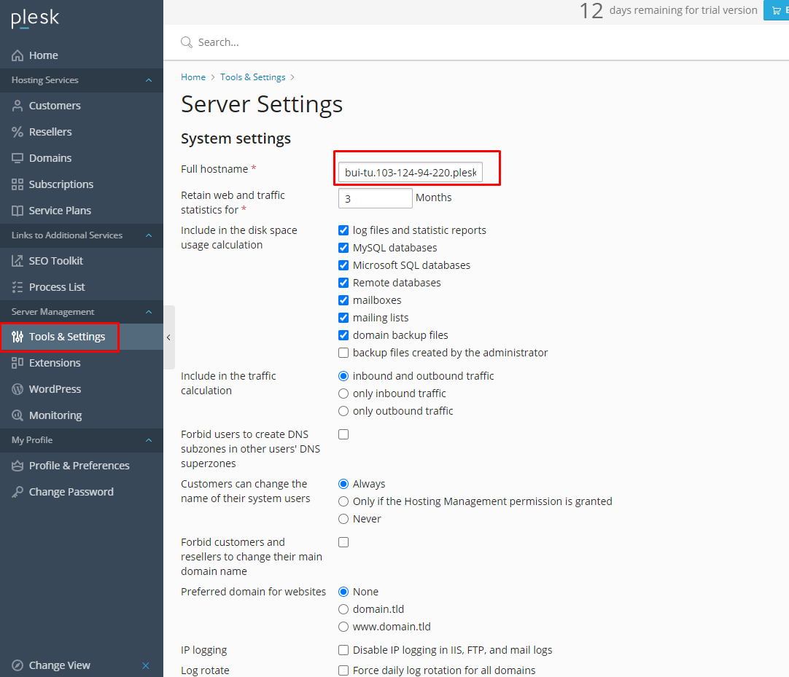

# Thay đổi tên máy chủ
Để thay đổi tên máy chủ ta làm như sau

Bước 1: Đăng nhập và trang quản trị

Bước 2: Tới `Tools & Settings` -> `Server Settings`

Bước 3: Nhập tên muốn đổi vào trường `Full hostname`

Bước 4: Chọn `OK`

