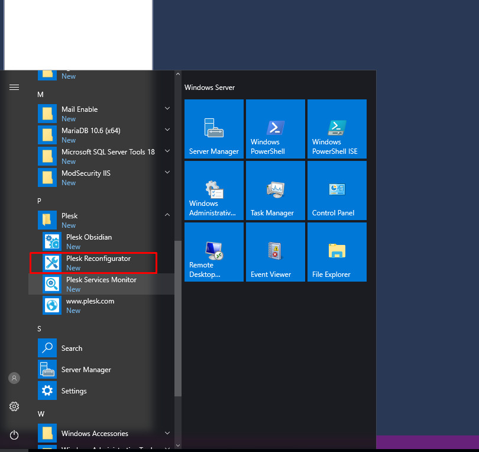
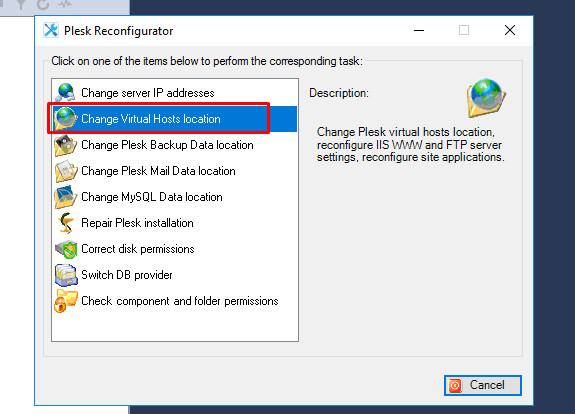
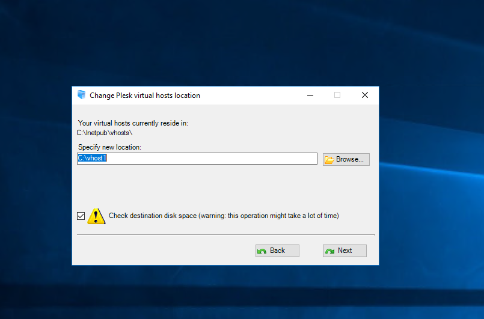
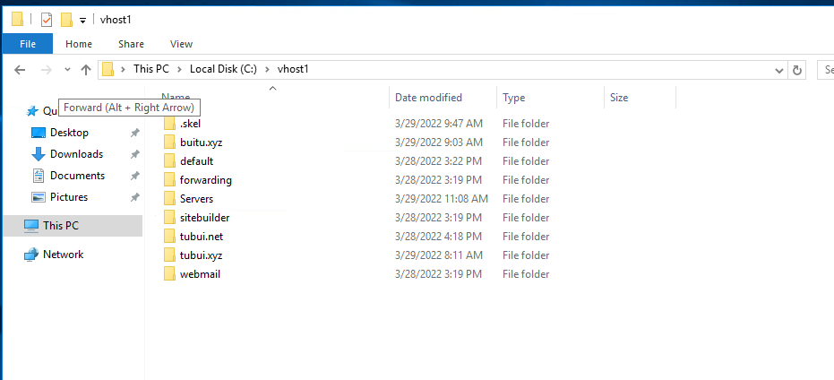

# Di chuyển thư mục vhost
- Tùy chọn này cho phép di chuyển thư mục nơi chứa các máy chủ ảo đến một vị trí khác trên cùng một phân vùng hoặc một phân vùng khác. Sử dụng tính năng này khi không đủ dung lượng ổ đĩa trên phân vùng hiện tại để chứa các máy chủ ảo mới mà ta muốn chuyển tất cả chúng sang một ổ đĩa mới lớn hơn

- Để di chuyển thư mục máy chủ ảo đến một vị trí mới, ta làm như sau:
	+ Đăng nhập vào Plesk với quyền quản trị
	+ Trong menu `Windows Start` của Windows, chọn `Plesk` -> Khởi chạy `Plesk Reconfigurator`

	

	+ Trong `Plesk Reconfigurator`, chọn `Change Virtual Hosts location`

	

	+ Chỉ định một vị trí mới cho vhost và nhấn vào `Next`. Tất cả dữ liệu trang web hiện có cũng sẽ được chuyển sang vị trí mới
		+ Lưu ý: Trong thời gian này, các trang web sẽ bị dừng hoạt động
		+ Thư mục vị trí mới phải trống

	
	
>> Trong quá trình này, tất cả các dịch vụ của Plesk sẽ được khởi động lại

- Kiểm tra

>> Ta thấy thư mục vhost đã được chuyển đến vhost1