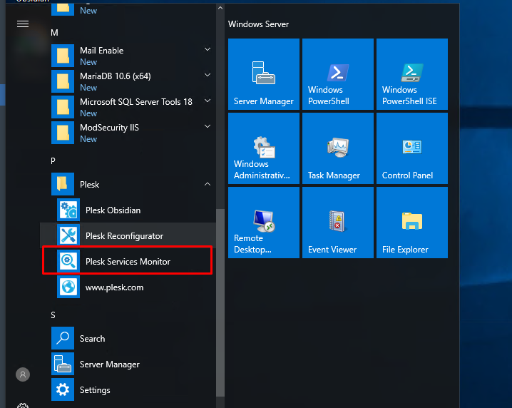
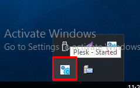
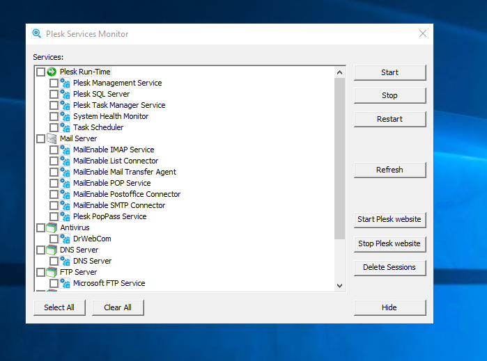

# Kiểm tra trạng thái của dịch vụ hệ thống 
- Ta có thể theo dõi trạng thái của máy chủ do Plesk quản lý mà không cần đăng nhập vào Plesk. Để thực hiện việc này, ta cần truy cập máy chủ của mình qua Remote Desktop
- Tại menu `Windows Start` của Windows, chọn `Plesk` -> Khởi chạy `Plesk Service Monitor`

- `Plesk Service Monitor` được tải tự động mỗi khi Plesk khởi động. Để quản lý trạng thái của các dịch vụ của Plesk, ta mở Plesk Services Monitor bằng cách nhấn đúp vào biểu tượng của nó trên thanh tác vụ

- Sau khi mở `Plesk Service Monitor`, ta có thể thấy trạng thái của tất cả các dịch vụ quan trọng của Plesk

- Thao tác:
	+ Để dừng một dịch vụ, ta tích vào dịch vụ tương ứng và click vào `Stop`
	+ Để khởi động lại một dịch vụ, ta tích vào dịch vụ tương ứng và click vào `Restart`
	+ Để bắt đầu một dịch vụ, ta tích vào dịch vụ tương ứng và nhấn click `Start`
	+ Để làm mới danh sách các dịch vụ và trạng thái tương ứng của chúng, click `Refresh`
	+ Để xóa tất cả thông tin về phiên Plesk khỏi cơ sở dữ liệu của Plesk và ngắt kết nối tất cả người dùng khỏi Plesk, hãy click vào `Delete Sessions` . Điều này hữu ích khi bạn cần khởi động lại Plesk, nhưng một số người dùng vẫn kết nối với nó và bạn muốn tránh mất dữ liệu hoặc hỏng tệp có thể xảy ra
	+ Để ẩn màn hình dịch vụ trở lại thanh tác vụ, click `Hide`
