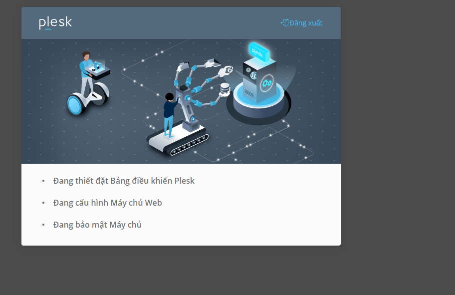

# Giới thiệu về Plesk
## Plesk là gì?
- Plesk là một công cụ hay hệ thống quản trị website cao cấp, được ưa chuộng nhất trong thời điểm hiện tại. Phần mềm này có khả năng quản trị hosting, tên miền và thiết kế website, giao diện... cùng mọi tác vụ có liên quan đến trang web

- Bên cạnh đó. Plesk còn có khả năng điều chỉnh tên miền và bảo mật website SSL. Giúp tối ưu hóa cùng với thao tác đơn giản nhằm giảm thời gian thực hiện. Tính tự động hóa của Plesk cũng là lý do khiến nó được ưu ái hơn 

- Plesk được người dùng tin cậy bởi những chức năng được tối ưu riêng cho mục đích của người sử dụng - từ cá nhân đến tổ chức
	+ Phân cấp độ sử dụng: Quản trị viên (Administrator), đại lý (Reseller), khách hàng các nhân (User)
	+ Tính bảo mật cao
	+ Hỗ trợ chăm sóc khách hàng 1 cách tự động nhanh chóng
	+ Khả năng tự động hóa cao cấp, giúp người dùng tiết kiệm thời gian trong việc quản lý
	+ Dễ dàng mở rộng mạng lưới kết nối kinh doanh
	+ Liên tục cập nhật các tính năng mới nhất phục vụ nhu cầu và mục đích của từng người sử dụng

## Các phiên bản của Plesk 
- Hiện Plesk có 2 phiên bản là Plesk Onyx và Plesk Obsidian

- Plesk Onyx được biết đến như phiên bản quản lý trang web đầu tiên của Plesk. Nó sở hữu toàn bộ tính năng cơ bản hỗ trợ quản lý, điều chỉnh ứng dụng trên website như quản lý dữ liệu, bảo mật, điều chỉnh hiệu suất và tự động cập nhật dữ liệu, tính năng

- Plesk Obsidian là phiên bản mới ra mắt vào năm 2019. Nó chủ yếu tập trung vào vấn đề bảo mật, hiệu suất cùng với sự tiện dụng. Xét về tính năng, bản Obsidian tối ưu hơn Onyx ở:
	- Khả năng giám sát, kiểm soát website
	- Cho phép chia quyền kiểm soát domain
	- Tích hợp các tiện ích PHP
	- Hỗ trợ quản lý tệp nhờ vào tính năng tải hàng loạt
	- Quản lý SSL, tích hợp bộ nhớ đám mây, thiết lập email đơn giản, tối ưu hóa giao diện

## Ưu điểm của Plesk
- Plesk là một trong những phần mềm thân thiện với người dùng nhất hiện nay nhờ những tính năng nổi bật:
- Dễ dàng sử dụng trên cả hai nền tảng là Window và Linux
- Có độ ổn định và tin cậy cao cùng nhiều phần mềm tích hợp hữu ích 
- Có đầy đủ tính năng hữu ích trong việc quản lý hosting và website
- Giao diện đơn giản, thân thiện với người dùng
- Có khả năng thiết lập nhiều hosting cùng một lúc, dễ dàng dựa trên cấu hình định sẵn
- Có thể tạo nhiều tài khoản FTP kết hợp với cấu trúc web linh hoạt 

# Cài đặt Plesk trên Centos 7
Bước 1: Cập nhật hệ thống
```sh
yum update -y
```

Bước 2: Cài đặt Plesk
- Chạy câu lệnh sau
```sh
sh <(curl https://autoinstall.plesk.com/one-click-installer || wget -O - https://autoinstall.plesk.com/one-click-installer)
```

- Sau khi cài đặt hoàn tất, hệ thống sẽ hiện thông báo thông tin đăng nhập quản trị. Ta đăng nhập với thông tin là SSH của mình
- Địa chỉ truy cập vào Admin Control sẽ là
	+ Link truy cập `ip:8443`
	+ User: root
	+ Pass: Password của root


- Đăng nhập thành công, ta sẽ bắt đầu khởi tạo tài khoản Administrator. Điền các thông tin email, mật khẩu và License Plesk (nếu chưa có License có thể chọn bản dùng thử 15 ngày)


- Hệ thống sẽ bắt đầu khởi tạo, sau khi hoàn tất sẽ hiện ra giao diện quản lý của Plesk




