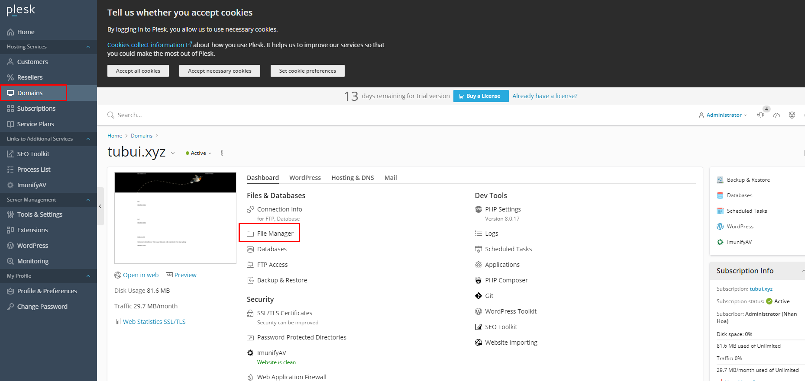
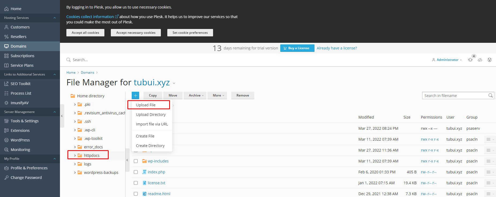
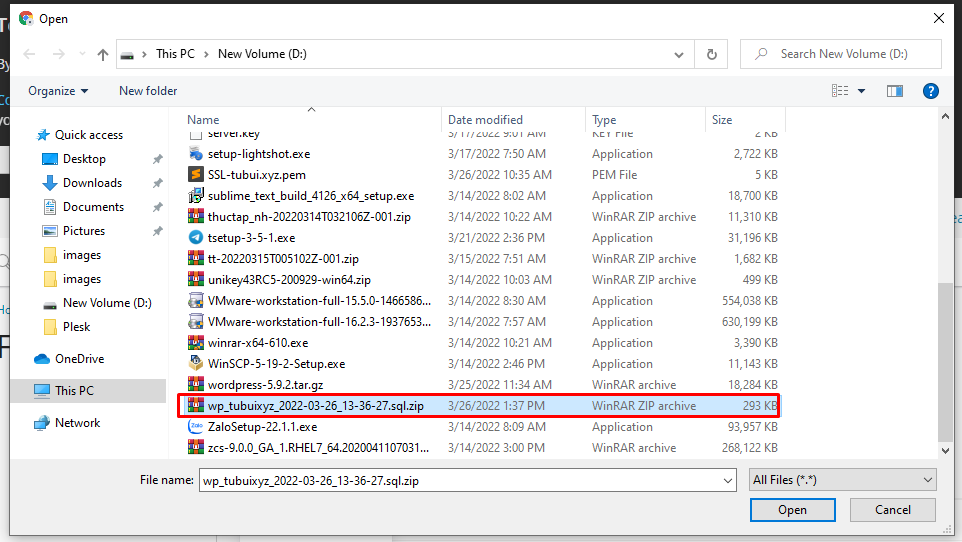
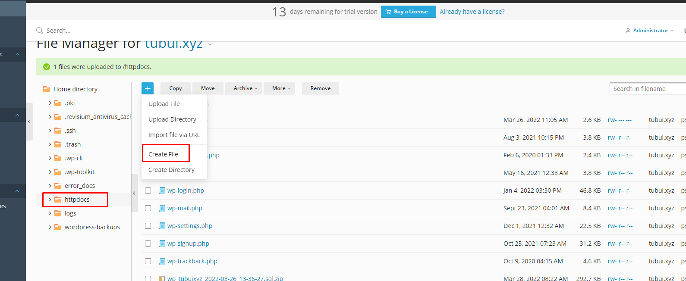
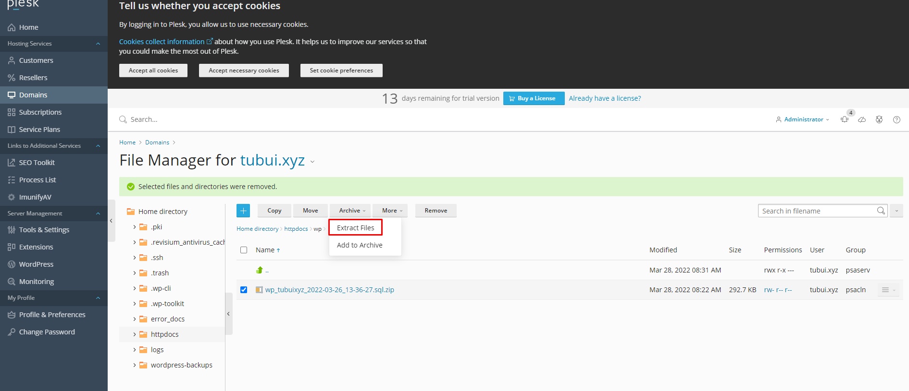
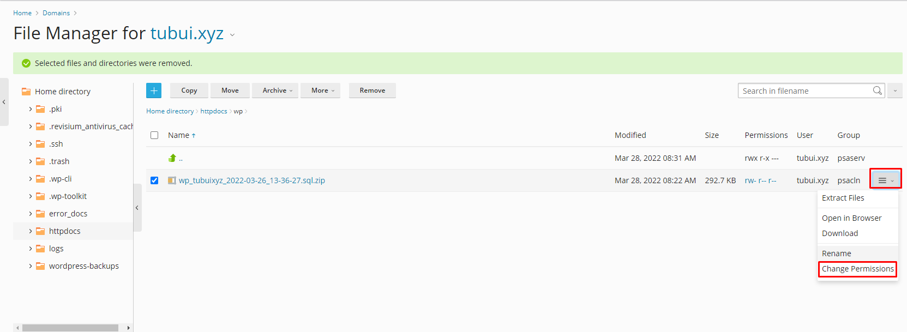
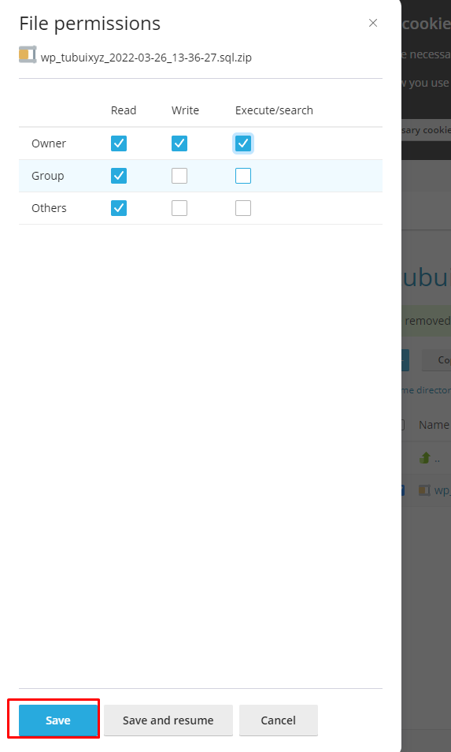

# Quản lý tập tin, thư mục trên hosting Plesk
## Upload dữ liệu
- Để upload một tập tin, hãy chọn thư mục gốc (httpdocs) trên thanh menu và ấn vào nút Upload ở phía trên thanh công cụ 

- Sau đó giao diện upload tập tin sẽ mở ra, ta có thể chọn file upload file dữ liệu để upload lên trên hosting

## Thêm xóa sửa và di chuyển tập tin thư mục 
- Cách tạo thư mục/tập tin: Click vào Create Directory/Create File trên thanh công cụ

- Xóa thư mục/tập tin thì chỉ cần tích chọn thư mục cần xóa chọn remove
- Di chuyển tập tin và thư mục cần di chuyển, chọn move trên thanh công cụ và sau đó chọn thư mục cần di chuyển đến

## Nén và giải nén file 

- Giải nén tập tin, thư mục cần giải nén bằng cách chọn `Archive` -> `Extract File`, để nén tập tin ta chọn `Add to Archive` và đặt tên cho file nén

## Phân quyền 
- Vào `File Manager` chọn thư mục cần phân quyền, chọn `Change Permission`

- Phân quyền như ý muốn và chọn Save để lưu lại

