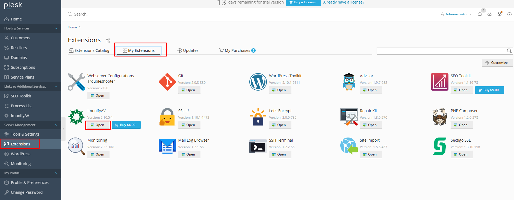
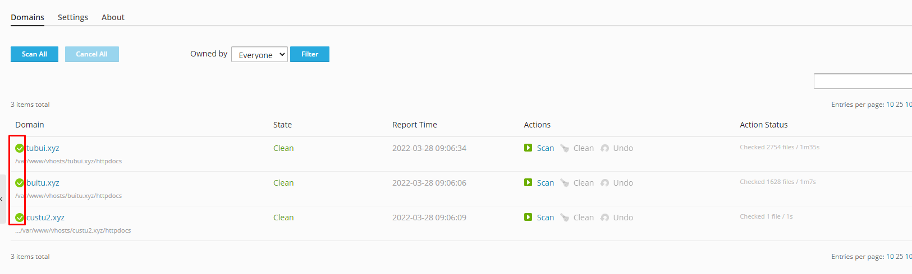

# ImunifyAV trên Plesk
- ImunifyAV là phiên bản miễn phí của Imunify360 - phần mềm bảo mật Linux. 
## Các tính năng của ImunifyAV
- Phát hiện bất kỳ loại tệp độc hại nào bao gồm backdoor, web-shell, virus, các trang lừa đảo và những thứ khác ...
- Dọn dẹp phần mềm độc hại tự động bằng 1 click, quét trang web theo lịch trình và yêu cầu
- Luồng giao diện người dùng được tối ưu hóa để giám sát bảo mật của hàng trăm người dùng và hàng nghìn tên miền mỗi máy chủ
- Quyền truy cập có thể cấu hình vào Antivirus cho các đăng ký khác nhau

## Sử dụng ImunifyAV
- Để quét phần mềm độc hại trên trang web bằng ImunifyAV, Tại tab `Server Management` -> chọn `Extensions` -> `My Extensions` -> `ImunifyAV`

- Để quét phần mềm độc hại trên trang web bằng ImunifyAV ta có thể chọn từng trang web để quét hoặc chọn `Scan All` để quét tất cả: Imunify sẽ xếp hàng đợi các tác vụ để quét nhanh trang web để tìm virus, backdoor, web-shell, hacker's scripts, các trang lừa đảo và phần mềm độc hại khác
- Quá trình quét trang web tùy thuộc vào số luồng quét đồng thời được chỉ định trong tab `Setting`. Ngoài ra, ImunifyAV sẽ kiểm tra từng tên miền để biết trạng thái danh sách đen trong các công cụ tìm kiếm và dịch vụ chống virus
- Khi quá trình quét kết thúcm hãy kiểm tra trạng thái lây nhiễm của các trang web. Nếu hiện dấu tích xanh bên cạnh tên miền như hình dưới có nghĩa trang web không bị xâm nhập cũng không bị nhiễm và bị đưa vào danh sách đen

- Nếu nhận "Cảnh báo màu đỏ" bên cạnh tên miền thì rất có thể là trang web đã bị xâm nhập và vị nhiễm virus. Click vào nút xem báo cáo và xem chi tiết
- Nếu nhận "Cảnh báo màu cam" cùng thông báo "Domain blacklisted" có nghĩa là tên miền bị đưa vào danh sách đen trong các công cụ tìm kiếm hoặc dịch vụ chống virus. Nhấp vào nút xem báo cáo để xem chi tiết trạng thái danh sách đen

>> Khi nhận được danh sách hãy kiểm tra các file này, liên hệ chuyên viên thiết kế website để được rà soát lại mã nguồn