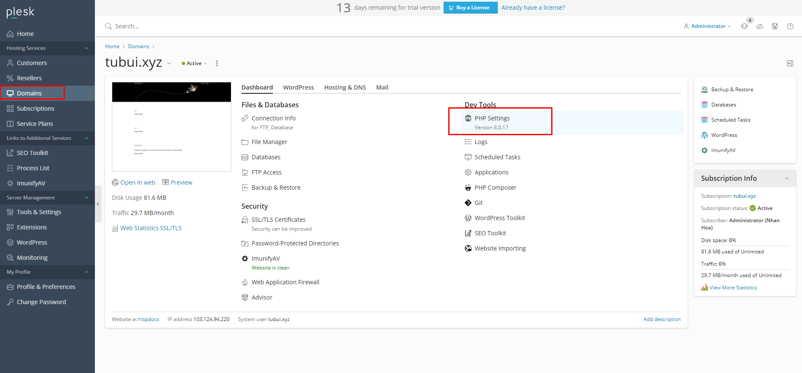
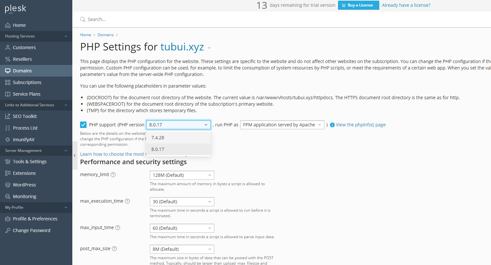

# Hướng dẫn chọn phiên bản PHP trên Plesk 
- Mỗi loại mã nguồn (có thể bao gồm các plugins, công cụ ...) khác nhau sẽ cần có cấu hình phiên bản PHP tương thích để có thể hoạt động ổn định
- Để tùy chỉnh phiên bản PHP riêng cho mỗi website của mình ta làm như sau:
Bước 1: Truy cập quản trị Plesk
Bước 2: Thiết lập phiên bản PHP
- Sau khi vào được trang quản trị Plesk, hãy tiếp tục vào mục `Domains` tìm đến website cần thay đổi phiên bản PHP, click chọn `PHP Settings`

- Lựa chọn phiên bản PHP phù hợp và lưu lại bằng cách nhấn `OK` hoặc `Apply`

- Khi thay đổi thành công sẽ có thông báo màu xanh hiện ra, ta cần đợi vài phút để cấu hình được cập nhật lại trên hệ thống