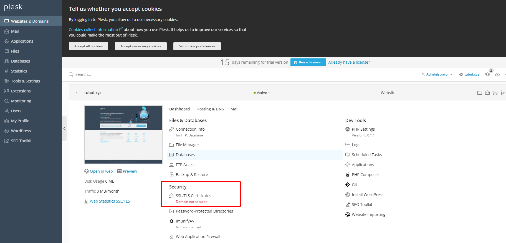

# Cài đặt SSL trên Plesk
Bước 1:
- Trong Plesk control Panel, vào mục `Website & Domain` -> chọn `SSL/TLS Certificate`

Bước 2: Tại mục `Download or remove existing certificates`, click nút `Manage`

Bước 3: Click `Add SSL Certificates`

Bước 4: Sinh CSR để đăng ký SSL

Bước 5: Lấy thông tin CSR

Bước 6: Cài SSL Certificate

Bước 7: Kích hoạt SSL cho host: Vào `Plesk control Pannel` -> `Hosting Settings`