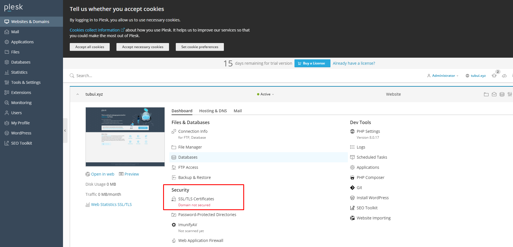
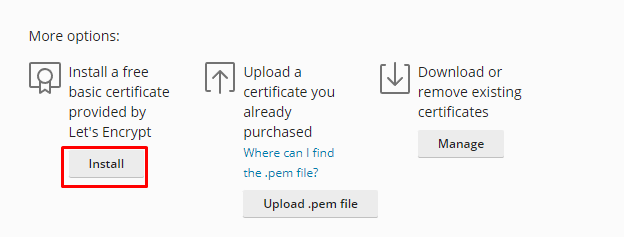
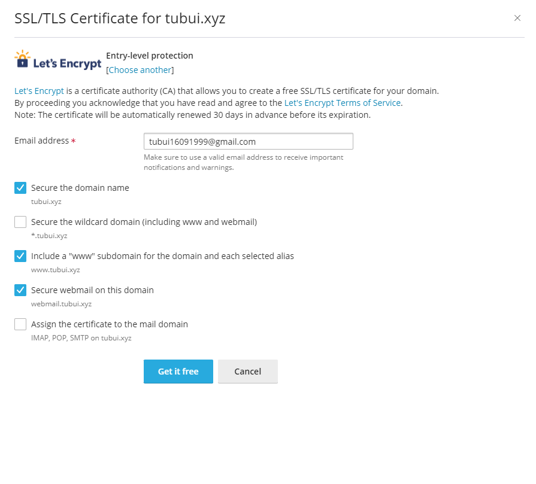
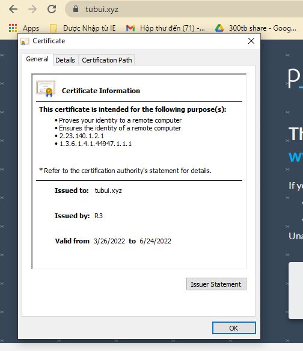

# Cài đặt SSL trên Plesk
Bước 1:
- Trong Plesk control Panel, vào mục `Website & Domain` -> chọn `SSL/TLS Certificate`

Bước 2: Tại mục `Install a free basic certificate provided by Let's Encrypt` chọn `Install`

Bước 3: Thiết lập cho SSL Let's Encrypt sau đó click `Get it free`

- Kiểm tra 

