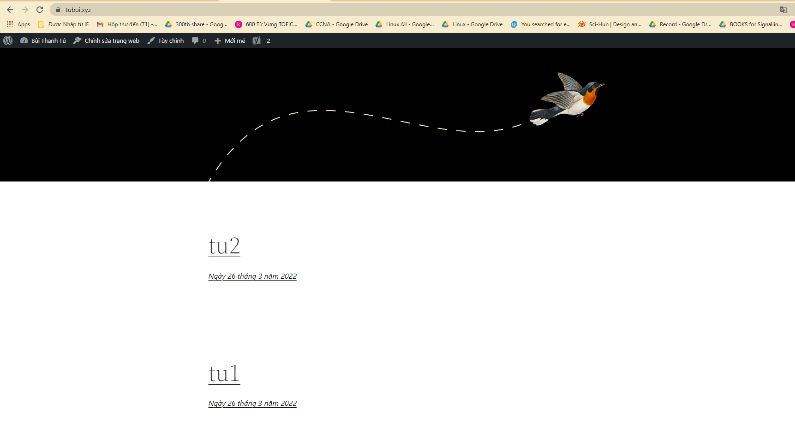
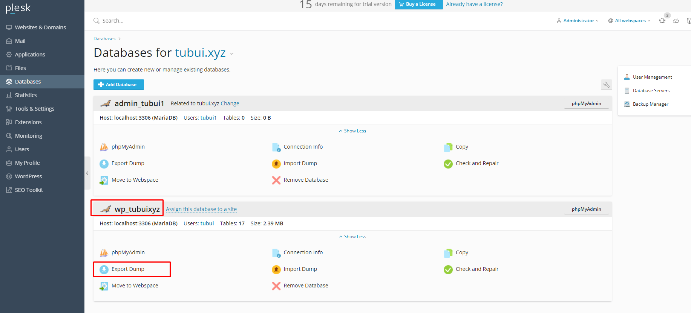
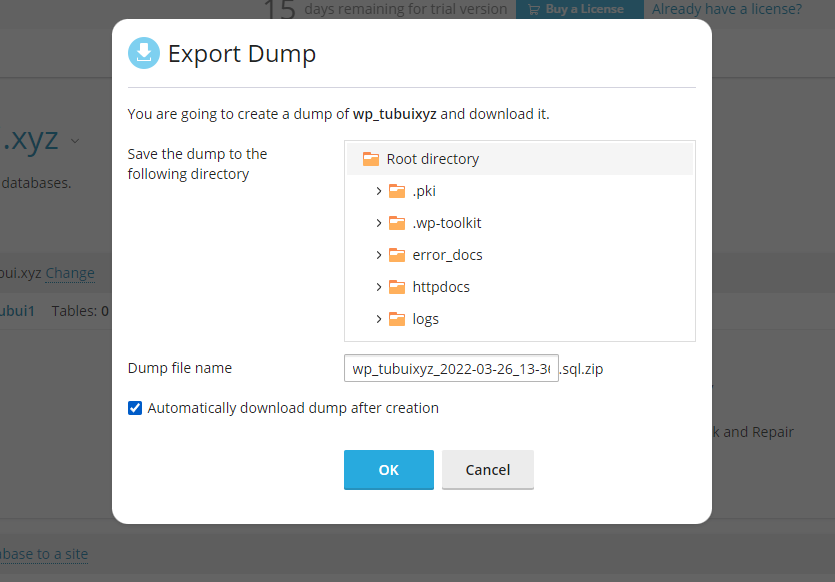
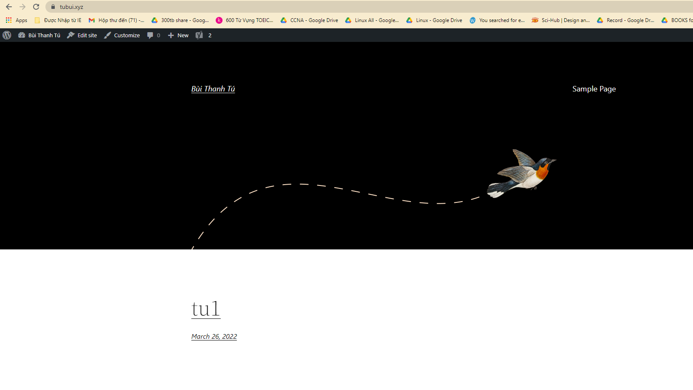
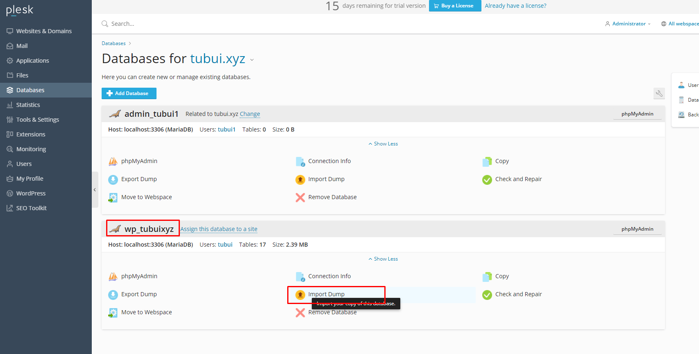
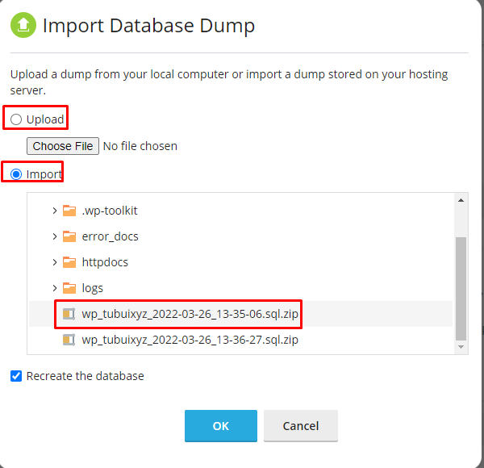
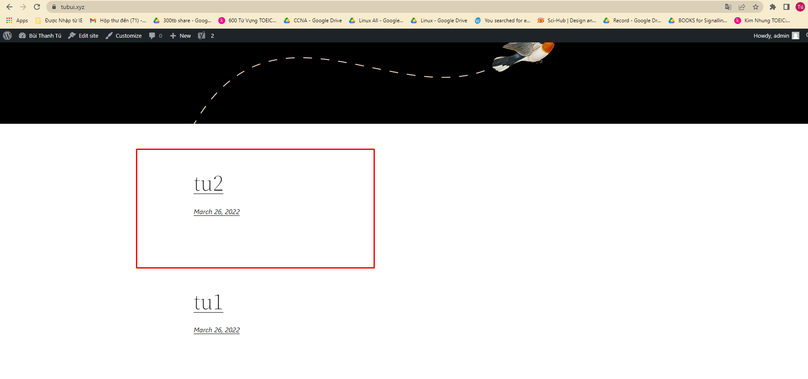

# Backup
- Tạo 2 bài vuể trước khi Backup

- Tại giao diện quản trị của Plesk -> chọn `Databases` -> `Export Dump` database muốn backup

- Tải file backup về máy

# Restore
- Xóa 1 bài viết trước khi restore

- Tại giao diện quản trị của Plesk -> chọn `Databases` -> `Import Dump` database muốn restore

- Ta có thể chọn Upload file backup từ máy tính hoặc Import file đã Export ở trên. Chọn đúng file Backup

- Kiểm tra 

>> Ta thấy bài viết bị xóa đi đã được khôi phục