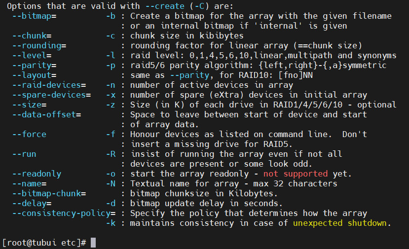
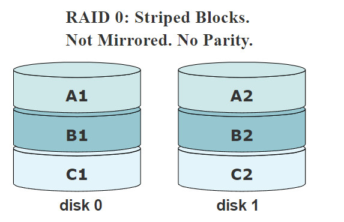
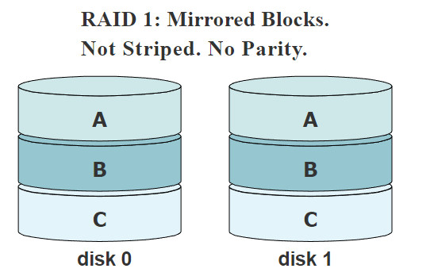
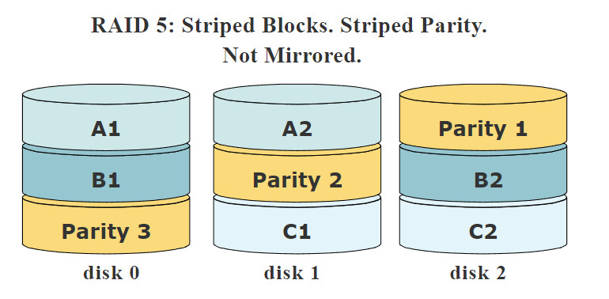

# RAID
## Khái niệm 
- RAID (Redundant Arrays of Inexpensive Disks) là hình thức ghép nhiều ổ đĩa cứng vật lý thành một hệ thống ổ đĩa cứng có các chức năng gia tăng tốc độ đọc/ghi dữ liệu hoặc nhằm tăng thêm sự an toàn của dữ liệu chứa trên hệ thống
## Hoạt động của RAID trong Linux
- RAID được tạo thành từ một loạt các mảng (tập hợp các đĩa). Mảng RAID là một tập hợp hai hoặc nhiều đĩa được kết hợp với một bộ điều khiển RAID, tạo thành một đĩa logic. Tùy thuộc vào cấu hình hoặc thiết lập được gọi là mức RAID
- RAID hoạt động bằng cách lưu trữ dữ liệu trên nhiều đĩa, cho phép các hoạt động đầu vào/đầu ra cân bằng để tăng hiệu suất của nó
## Lợi ích của RAID 
- Dự phòng: Nếu một đĩa bị treo, dữ liệu sẽ được sao chép trên các đĩa khac, tránh mất mát dữ liệu
- Hiệu suất: Bằng cách ghi dữ liệu vào nhiều đĩa, tốc độ truyền dữ liệu tổng có thể được tăng lên
- Thuận tiện: Việc thiết lập RAID đơn giản hơn và việc lưu trữ từ một số đĩa vật lý có thể được xử lý ngay cả khi chúng nằm trong các hệ thống khác nhau
## RAID trong Linux
-  Để làm cho RAID hoạt động dễ dàng trong Linux, công cụ có tên `mdadm` được sử dụng. `mdadm` về cơ bản là một hệ thống dòng lệnh cho phép thao tác dễ dàng và nhanh chóng với các thiết bị RAID
- `mdadm` (quản trị nhiều thiết bị) là một công cụ cực kỳ hữu ích để chạy hệ thống RAID. Nó là một công cụ để tạo, quản lý và giám sát các thiết bị RAID bằng cách bằng cách sử dụng nhiều trình điều khiển md. Có thể toàn bộ đĩa (`/dev/sdb`, `/dev/sdc`) hoặc phân vùng riêng lẻ (`/dev/sdb1`, `/dev/sdc1`) như một thành phần của một mảng
- Lợi ích của `mdadm`
	+ `mdadm` có thể chẩn đoán, giám sát và thu thập thông tin chi tiết về các mảng
	+ `mdadm` là một chương trình tập trung, không phải là một tập hợp các chương trình phân tán
	+ `mdadm` có thể thực hiện hầu hết tất cả các chức năng của nó mà không cần có tệp cấu hình 

### Cài đặt mdadm
```sh 
yum install mdadm -y
```
### Tệp cấu hình 
- Tệp `/etc/mdadm.conf` được sử dụng để xác định thiết bị nào là thiết bị RAID và thiết bị củ thể thuộc về mảng nào
- Mặc định tệp này không tồn tại và cần phải tạo thủ công
### Tạo thiết bị RAID
- Để liệt kệ các option tạo thiết bị RAID với `mdadm` sử dụng câu lệnh sau
```sh
mdadm --create --help
```



## Chế độ Tuyến Tính: 
- 2 hoặc nhiều đĩa được kết hợp thành một thiết bị vật lý
- Các đĩa được 'nối' vói nhau vì thế việc ghi tuyến tính vào thiết bị RAID sẽ làm đầy "đĩa 0" trước, sau đó đến "đĩa 1" ...
- Các đĩa không nhất thiết phải cùng kích thước 
- Hiệu suất đọc và ghi sẽ không tăng đối với các lần đọc/ghi đơn lẻ. Nhưng nếu một số người dùng sử dụng thiết bị, các đĩa khác nhau cùng một lúc, hiệu suất sẽ tăng lên

>> Để tạo 2 đĩa ở chế độ tuyến tính bằng `mdadm`
```sh
mdadm --create --verbose /dev/md0 --level=linear --raid-devices=2 /dev/sdb /dev/sdc
mdadm: Defaulting to version 1.2 metadata
mdadm: array /dev/md0 started
```

### Chế độ RAID-0



- Dữ liệu được ghi trên các ổ đĩa hay còn gọi là "sọc". Điều này có nghĩa là nó có thể được đọc đồng thời từ nhiều ổ đĩa 
- Các thiết bị phải có cùng kích thước 
- Không thể cứu dữ liệu nếu một ổ đĩa bị lỗi
- Hiệu suất đọc và ghi sẽ tăng lên, vì việc đọc và ghi được thực hiện song song trên các thiết bị
- 

>> Để tạo 2 đĩa ở chế độ RAID 0 bằng `mdadm`
```sh
mdadm --create --verbose /dev/md0 --level=0 --raid-devices=2 /dev/sdb /dev/sdc
```

### Chế độ RAID-1



- Mỗi khi dữ liệu được ghi vào một thiết bị RAID 1, nó sẽ được chuyển đến cả 2 ổ đĩa trong cặp
- Chế độ này có dự phòng
- RAID-1 có thể sử dụng trên 2 hoặc nhiều đĩa với nhiều đĩa dự phòng hoặc không
- Chế độ này duy trì 1 bản sao chính xác thông tin của một đĩa trên các đĩa khác
- Các đĩa phải có kích thước bằng nhau
- Nếu một đĩa lớn hơn đĩa khác, thiết bị RAID sẽ có kích thước bằng kích thước đĩa nhỏ nhất
- Nếu có đến N-1 đĩa bị xóa hoặc bị hỏng, dữ liệu vẫn nguyên vẹn. Nếu có sẵn các đĩa dự phòng, việc tái tạo đĩa sẽ ngay lập tức bắt đầu trên một trong các đĩa dự phòng sau khi phát hiện ra lỗi của ổ đĩa
- Hiệu suất ghi thường kém hơn trên một thiết bị vì cùng một dữ liệu phải được ghi đồng thời trên 2 hoặc nhiều thiết bị

>> Thiết lập RAID-1 với 2 đĩa và 1 đĩa dự phòng bằng `mdadm`
```sh
mdadm --create --verbose /dev/md0 --level=1 --raid-devices=2 /dev/sdb /dev/sdc --spare-devices=/dev/sdd
```

### Chế độ RAID-4
- Mức RAID này không được sử dụng thường xuyên
- Có thể sử dụng trên 3 hoặc nhiều đĩa
- Thay vì sao chép hoàn toàn thông tin, nó giữ thông tin chẵn lẻ trên một ổ đĩa và ghi dữ liệu vào các đĩa khác theo cách giống như RAID-0
- Vì một đĩa được dành riêng cho thông tin chẵn lẻ, kích thước của mảng sẽ là (N-1)*S, trong đó S là kích thước của ổ đĩa nhỏ nhất trong mảng.
- Nếu một ổ đĩa bị lỗi, thông tin chẵn lẻ có thể được sử dụng để tái tạo lại tất cả dữ liệu. Nếu hai ổ đĩa bị lỗi, tất cả dữ liệu sẽ bị mất

>> Thiết lập RAID-4 với 4 đĩa và 1 đĩa dự phòng bằng `mdadm`
```sh
mdadm --create --verbose /dev/md0 --level=4 --raid-devices=4 /dev/sdb /dev/sdc /dev/sdd /dev/sde  spare-devices=/dev/sdf
```

### Chế độ RAID-5



- Thay vì lưu trữ bản sao hoàn chỉnh của dữ liệu, RAID-5 có thể tiết kiệm dung lượng bằng cách lưu trữ dữ liệu chẵn lẻ. Tính chẵn lẻ cho phép các RAID tái tạo lại dữ liệu được lưu trữ trên các ổ đĩa bị lỗi
- RAID-5 có thể được sử dụng trên ba hoặc nhiều đĩa, với nhiều đĩa dự phòng hoặc không.
- Kích thước thiết bị RAID-5 sẽ là (N-1)*S, giống như RAID-4
- Sự khác biệt lớn giữa RAID-5 và -4 là thông tin chẵn lẻ được phân phối đồng đều giữa các ổ đĩa tham gia
- Nếu một trong các đĩa bị lỗi, tất cả dữ liệu vẫn còn nguyên vẹn, nhờ vào thông tin chẵn lẻ. Nếu có sẵn các đĩa dự phòng, việc xây dựng lại sẽ bắt đầu ngay sau khi thiết bị bị lỗi. Nếu hai đĩa bị lỗi đồng thời, tất cả dữ liệu sẽ bị mất. RAID-5 có thể tồn tại sau một lần hỏng đĩa, nhưng không thể tồn tại hai hoặc nhiều hơn

>> Thiết lập RAID-5 với 3 đĩa và 1 đĩa dự phòng bằng `mdadm`
```sh
mdadm --create --verbose /dev/md0 --level=5 --raid-devices=3 /dev/sdb /dev/sdc /dev/sdd --spare-devices=/dev/sde
```

### Dừng/Bắt đầu và loại bỏ một mảng RAID
- Để dừng mảng RAID và xóa hoàn toàn khỏi hệ thống
```sh
mdadm --stop /dev/md0
mdadm --remove /dev/md0
```

- Để bắt đầu một mảng đã dừng:
```sh
mdadm --asemble /dev/md0
```

### Quản lí đĩa
- Thêm đĩa 
```sh
mdadm --add /dev/md0 /dev/sdd
```

- Xóa đĩa 
```sh
mdadm --manage /dev/md0 -f /dev/sdd
mdadm --manage /dev/mdadm -r /dev/sdd
```

